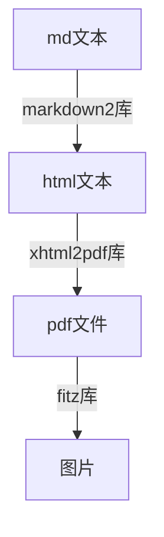
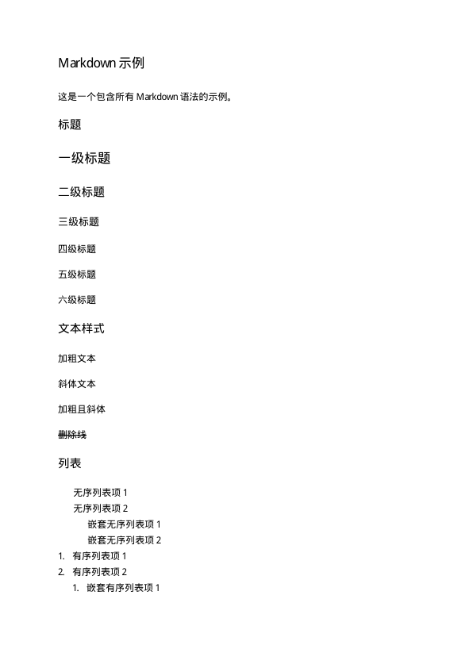
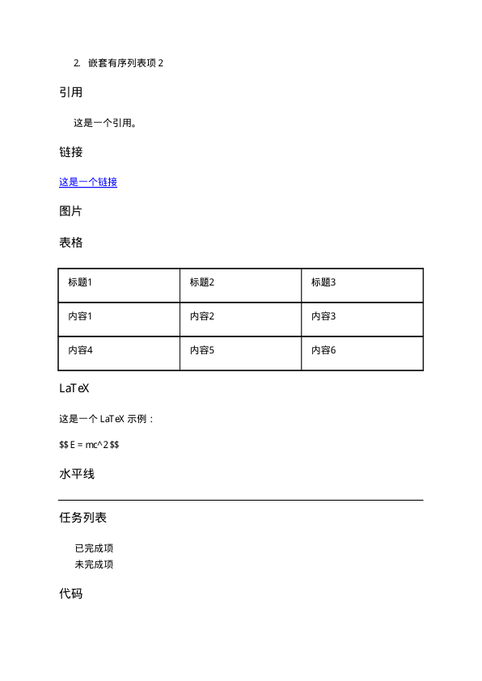
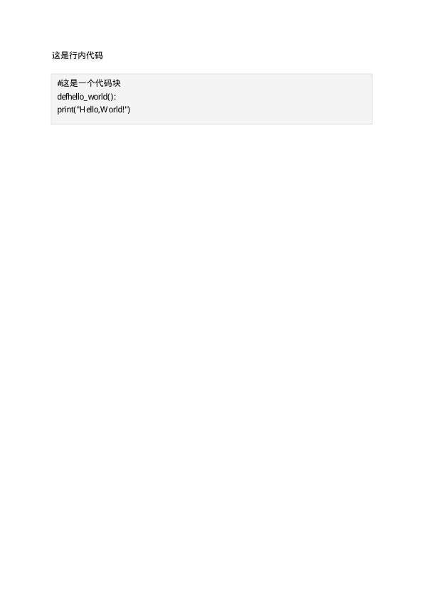

# Nonebot-Plugin-EasyMarkdown

[](https://daringfireball.net/projects/markdown/)


基于`fitz`与`xhtml2pdf`的格式化markdown语法，并转化为图片发送的插件

## 介绍
对于大语言模型越来越广泛使用的今天，大部分人在网页复制其回答总是会带有md的正则语法。导致许多时候我们要将其粘贴至word等地方时格式会很乱，并且还要手动去除这些语法，徒增麻烦。

同样的，并不是大多数人都会使用typora等md编辑软件

因此，本项目提供了一个简易的解决方案，只需将文本发送至bot，bot便能够将文本格式化并转化成图片发送回来，同时也包括去除了md语法的纯文本内容

## 安装

使用nb-cli进行安装：

```
nb plugin install nonebot-plugin-easymarkdown
```

或使用pip安装：

```
pip install nonebot-plugin-easymarkdown
```

## 使用

@机器人+``.md``+空格+md文本内容

## 原理

使用``markdown2``库将md文本转化为html，再使用``xhtml2pdf``库将html文本转化为pdf文件，最后使用``fitz``库将pdf文件转化为图片



图片发送完毕会立即删除生成的图片与pdf文件，不会占用服务器空间

为了保证插件的易用性，因此不使用``html2image``等需要自行安装第三方工具的库，所以bot运行起来可能会稍慢

## 图例







## 存在的问题

由于xhtml2pdf库对于中文较少的支持，所以不支持**粗体**、*斜体*、***倾斜粗体***的md文本

不支持latex表达式

代码块不支持代码高亮（有，但是不会高亮）

其余大部分md文本均可较好显示

## 贡献
欢迎提交Pull Request或报告Issues。

## 许可
[MIT License](LICENSE)